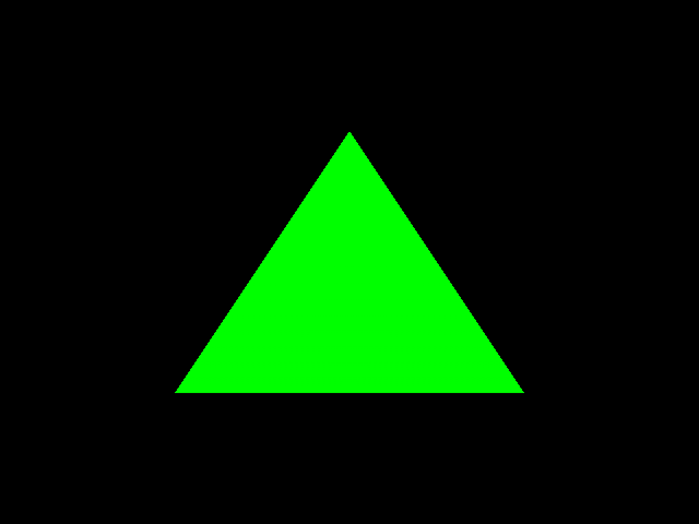
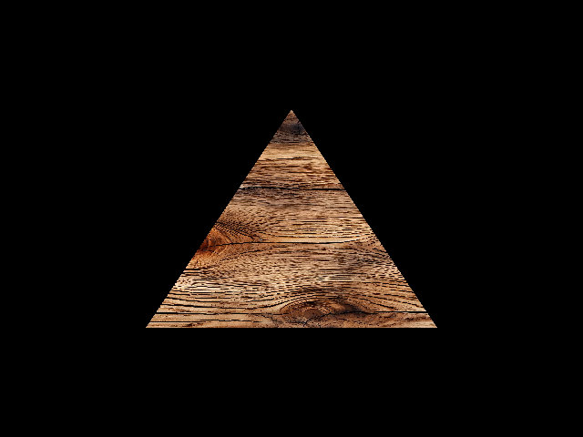
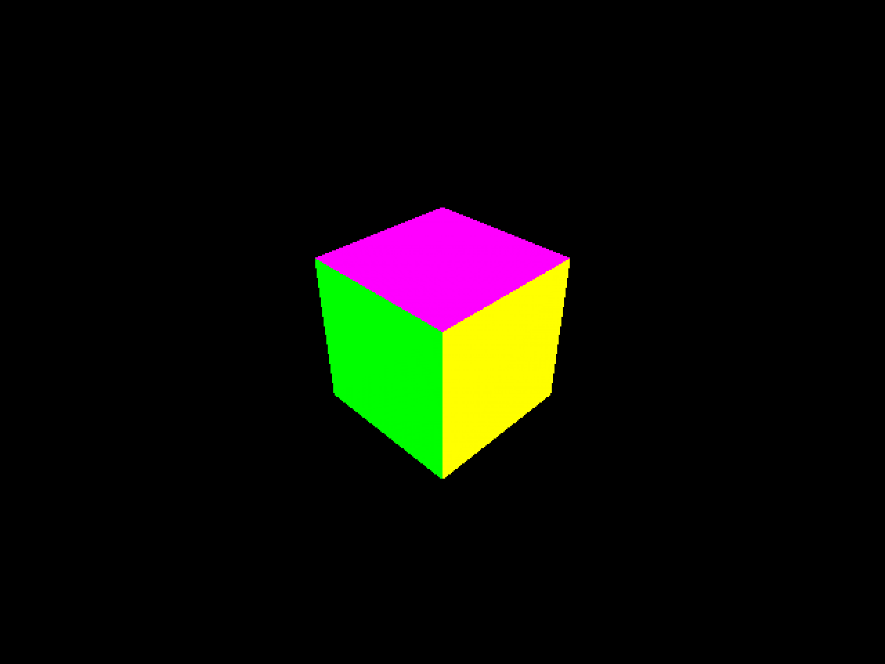
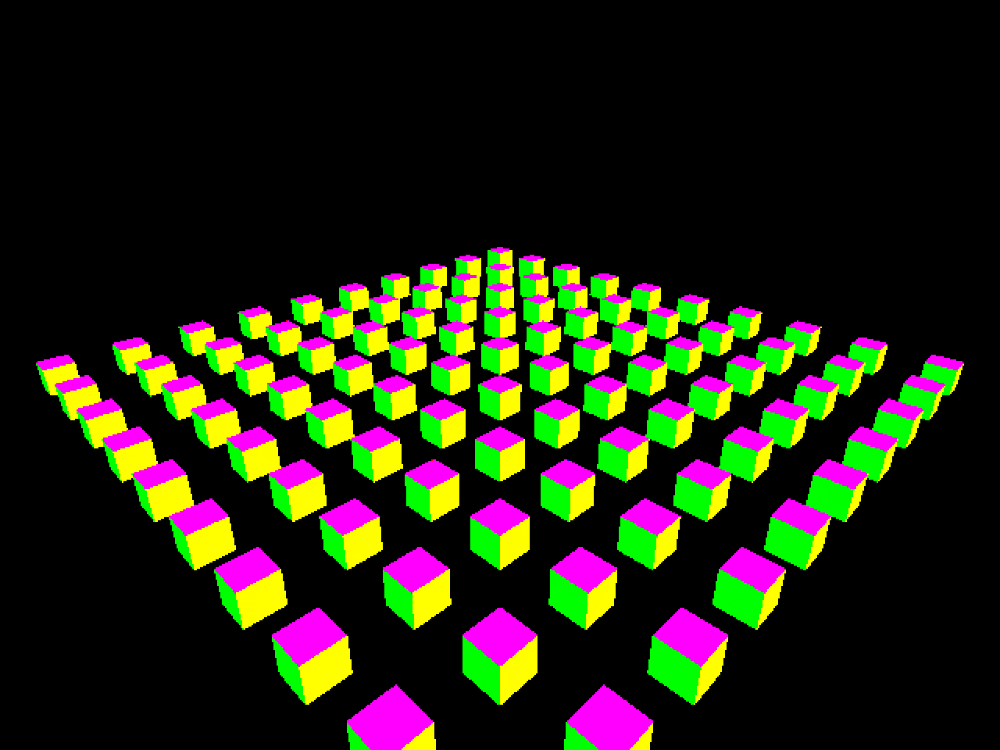
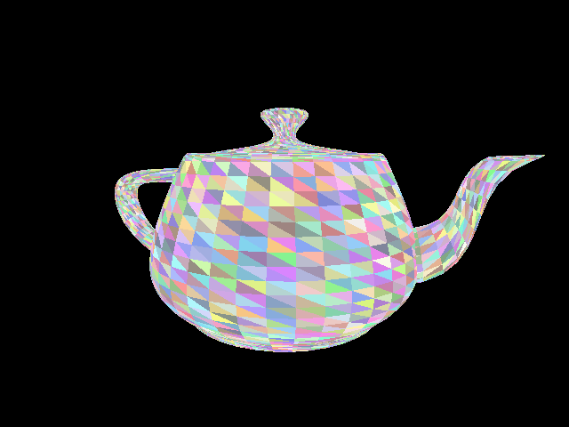

# SoftGPU

一款软件实现的 Tile-Based GPU 模拟器，支持性能分析与可视化。


---

## 特性

- **Tile-Based Rendering (TBR)** - 真正的 TBR 架构，支持 binning
- **8 级渲染管线** - CommandProcessor → VertexShader → PrimitiveAssembly → TilingStage → Rasterizer → FragmentShader → Framebuffer → TileWriteBack
- **ISA v2.5 解释器** - 50+ 条指令，支持可编程片元着色器
- **4 种 ISA 着色器类型** - Flat Color、Barycentric Color、Depth Test、Multi-Triangle
- **内存子系统** - Token bucket 带宽模型 + L2 缓存模拟（256KB）
- **Warp 调度器** - 批处理，8 线程 warps
- **性能分析器** - 实时各级阶段耗时与瓶颈检测
- **240 个测试** - 103 ISA + 99 E2E + 20 集成 + 18 场景测试
- **ImGui 可视化** - 架构图与利用率着色

---

## 架构

```
RenderPipeline (8 级管线)
├── CommandProcessor    # DrawCall 解析
├── VertexShader        # MVP 变换
├── PrimitiveAssembly   # 视锥体裁剪
├── TilingStage        # 三角形 binning（300 tiles）
├── Rasterizer         # 边缘函数 DDA
├── FragmentShader      # ISA v2.5 解释器，50+ 指令
├── Framebuffer        # Z-buffer 深度测试
└── TileWriteBack       # GMEM 回写

支持模块:
├── ShaderCore          # ISA 执行单元
├── Interpreter         # ISA v2.5 解释器
├── MemorySubsystem     # 带宽模型 + 256KB L2 缓存
├── FrameProfiler       # 性能数据采集
├── BottleneckDetector  # 瓶颈检测
└── ProfilerUI         # ImGui 可视化
```

---

## 构建

### 依赖

**Ubuntu:**
```bash
sudo apt-get install libgl1-mesa-dev libxkbcommon-dev libglfw3-dev libgtest-dev libgmock-dev
```

**macOS:**
```bash
brew install glfw3 googletest
```

**通用依赖:**
- OpenGL
- CMake 3.16+
- C++17 编译器

```bash
# 克隆
git clone https://github.com/dasbindus/SoftGPU.git
cd SoftGPU

# 构建
mkdir build && cd build
cmake .. -DCMAKE_BUILD_TYPE=Release
make -j4
```

---

## 测试

### 测试可执行文件

| 测试程序 | 测试数量 | 说明 |
|----------|----------|------|
| `test_golden_isa` | 103 | ISA 指令测试，验证解释器正确性 |
| `test_e2e` | 99 | E2E 测试，含 golden reference 对比 |
| `test_Integration` | 20 | 集成测试（6 IntegrationTest + 14 EarlyZTest）|
| `test_test_scenarios` | 18 | TestScene 单元测试 |
| `test_benchmark_runner` | - | 性能基准测试 |

### 运行测试

```bash
# 通过 ctest 运行所有测试
cd build && ctest --output-on-failure

# 运行所有测试可执行文件并查看摘要
./build/bin/test_golden_isa    # ISA 指令测试
./build/bin/test_e2e          # E2E 测试
./build/bin/test_Integration   # 集成测试
./build/bin/test_test_scenarios # TestScene 单元测试
```

### 运行特定测试

```bash
# 使用 gtest_filter 运行特定测试
./build/bin/test_golden_isa --gtest_filter="GoldenISATest.ADD_*"
./build/bin/test_e2e --gtest_filter="*TriangleCubes100*"
./build/bin/test_Integration --gtest_filter="EarlyZTest.*"

# 列出所有可用测试
./build/bin/test_golden_isa --gtest_list_tests
./build/bin/test_e2e --gtest_list_tests
```

### E2E Golden Reference 测试

E2E 测试将渲染结果与 golden reference 对比：

```bash
# 运行所有 E2E 测试
./build/bin/test_e2e

# 运行特定场景的 golden 测试
./build/bin/test_e2e --gtest_filter="*Scene001*"

# 查看 golden reference 文件
ls tests/e2e/golden/
```

---

## ISA 着色器类型 (v1.3)

片元着色器支持 4 种可编程着色器类型：

1. **Flat Color** - 简单直通，带颜色钳制
2. **Barycentric Color** - 顶点颜色插值
3. **Depth Test** - 每像素深度测试
4. **Multi-Triangle** - 多三角形复杂渲染

---

## 性能分析

FrameProfiler + BottleneckDetector 提供完整的性能分析能力：

### 阶段级分析
- **阶段耗时** - 纳秒级精度，60 帧滚动平均
- **各阶段调用次数** - 每帧各级 invocations 统计

### 瓶颈判定
| 瓶颈类型 | 判定依据 |
|----------|----------|
| ShaderBound | FragmentShader 耗时占比高 |
| MemoryBound | GMEM 带宽饱和度高 |
| FillRateBound | 光栅化输出受限 |
| ComputeBound | VertexShader 计算瓶颈 |

### 内存系统统计
- **GMEM 读写字节数** - `getReadBytes() / getWriteBytes()`
- **L2 Cache 命中率** - `getHitRate()` (256KB, 256 sets × 8-way)
- **带宽利用率** - Token Bucket 模型计算
- **访问次数统计** - `getAccessCount()`

### 微架构指标
- **Warp 调度统计** - fragments_executed, instructions_executed, cycles_spent
- **ShaderCore IPC** - `getIPC()` 每周期指令数
- **Rasterizer 效率** - `getRasterizerEfficiency()`

---

## 运行

### 帮助信息

```bash
./build/bin/SoftGPU --help
```

### GUI 模式（需要显示器）

```bash
# 基础用法
./build/bin/SoftGPU

# 带纹理采样场景
./build/bin/SoftGPU --scene Triangle-1Tri-Textured --texture tests/e2e/golden/texture1.png
```

### 无头模式（无需显示器）

```bash
# 基础用法（输出到当前目录）
./build/bin/SoftGPU --headless

# 输出到指定目录
./build/bin/SoftGPU --headless --output /tmp

# 自定义文件名
./build/bin/SoftGPU --headless --output-filename my_render.ppm

# 选择场景
./build/bin/SoftGPU --headless --scene Triangle-Cube

# 带纹理采样
./build/bin/SoftGPU --headless --scene Triangle-1Tri-Textured --texture tests/e2e/golden/texture1.png

# 禁用 TBR 模式
./build/bin/SoftGPU --headless --no-tbr

# 强制 VS 使用 C++ 路径（调试用）
./build/bin/SoftGPU --headless --vs-cpp

# 加载 OBJ 模型
./build/bin/SoftGPU --headless --obj tests/e2e/models/teapot.obj
```

### 可用场景

| 场景 | 三角形数 | 描述 |
|------|----------|------|
| Triangle-1Tri | 1 | 单个三角形 |
| Triangle-1Tri-Textured | 1 | 单个纹理三角形（需配合 --texture 使用）|
| Triangle-Cube | 12 | 立方体，6 面 |
| Triangle-Cubes-100 | 1200 | 100 个立方体，压力测试 |
| Triangle-SponzaStyle | 变化 | Sponza 风格建筑 |
| PBR-Material | 变化 | PBR 材质球 |
| OBJ-Model (cube.obj) | 12 | OBJ 立方体模型 |
| OBJ-Model (teapot.obj) | 6320 | Utah Teapot 茶壶模型 |

### OBJ 模型渲染

```bash
# 渲染 OBJ 模型（支持 cube.obj 和 teapot.obj）
./build/bin/SoftGPU --obj tests/e2e/models/cube.obj
./build/bin/SoftGPU --obj tests/e2e/models/teapot.obj

# 无头模式输出到指定目录
./build/bin/SoftGPU --headless --obj tests/e2e/models/teapot.obj --output /tmp/
```

### 渲染输出

渲染的 PPM 文件可用任意图像编辑器查看：

```bash
# 渲染并查看输出
./build/bin/SoftGPU --headless --scene Triangle-Cube
# 输出: frame_0000.ppm (640x480)

# 渲染纹理三角形
./build/bin/SoftGPU --headless --scene Triangle-1Tri-Textured --texture tests/e2e/golden/texture1.png
```

### 渲染效果

| Triangle-1Tri | Triangle-1Tri-Textured | Triangle-Cube |
|:---:|:---:|:---:|
|  |  |  |

| Triangle-Cubes-100 | Utah Teapot |
|:---:|:---:|
|  |  |

---

## 路线图 (v1.3+)

**当前版本: v1.5** - VS ISA 修复 + OBJ 模型加载、99 E2E + 103 ISA 测试

### 管线微架构改造状态

```
8 级渲染管线微架构实现进度

CommandProcessor     ▓▓▓░░░░░░░ 50%  [部分实现]
       ↓
VertexShader        ▓▓▓▓░░░░░░ 40%  [部分实现-ISA模式]
       ↓
PrimitiveAssembly   ███████░░░ 90%  [部分实现-近平面裁剪/Strip/Restart已完成]
       ↓
TilingStage        ▓▓▓▓▓▓▓▓░░ 90%  [部分实现]
       ↓
Rasterizer         ▓▓▓▓▓▓░░░░ 70%  [部分实现]
       ↓
FragmentShader      ▓▓▓▓▓▓▓▓░░ 90%  [部分实现]
       ↓
Framebuffer        ▓▓▓▓▓░░░░░ 60%  [部分实现]
       ↓
TileWriteBack      ▓▓▓▓▓▓▓░░░ 80%  [部分实现]

支持模块:
├── ShaderCore       ██████████ 100%  [已完成]
├── Interpreter      ██████████ 100%  [已完成]
├── MemorySubsystem ██████████ 100%  [已完成]
└── L2Cache         ██████████ 100%  [已完成]

注: WarpScheduler 为死代码，从未实例化
```

详细技术说明和差距分析见 [docs/STAGE_DETAILS.md](docs/STAGE_DETAILS.md)

### 各阶段待实现功能摘要

| 阶段 | 待实现功能 | 优先级 |
|------|-----------|--------|
| PrimitiveAssembly | ~~完整裁剪（近平面）~~ ~~Triangle Strip~~ ~~Primitive Restart~~ | ~~P0/P1~~ ✅ |
| TilingStage | 深度排序 | P1 |
| Rasterizer | MSAA 2×/4× | P1 |
| FragmentShader | Bilinear/mipmap 滤波 | P1 |
| Framebuffer | Stencil、Blend/Alpha | P2 |
| TileWriteBack | 压缩回写 | P2 |

> ✅ 近平面裁剪、Triangle Strip、Primitive Restart 已实现

### 版本计划

| 版本 | 主题 | 目标 |
|------|------|------|
| **v1.5** ✅ | VS ISA 修复 + OBJ 模型加载 | VIEW Transform 寄存器重叠修复、vcount_ bug 修复、多顶点处理修复、OBJ 模型加载、--obj 命令行选项、Utah Teapot (2026-04-20) |
| **v1.4.2** ✅ | ISA v2.5 指令集升级 | 50+ 指令、103 ISA 测试、CALL/RET 修复、Known Issues (2026-04-16) |
| **v1.4.1** ✅ | PNG 纹理加载增强 | 自动启用 shader、新增 Triangle-1Tri-Textured 场景、scene014 E2E (2026-04-07) |
| **v1.6** | 前端管线并行化 | CommandProcessor 预取/解码、VertexShader SIMD/流水线 |
| **v1.7** | 几何处理优化 | PrimitiveAssembly 并行剔除、TilingStage 原子化 |
| **v1.8** | 内存与带宽优化 | L2 Cache 优化、TileWriteBack 压缩、带宽分配器 |
| **v1.9** | 微架构级性能分析 | Warp 分析、IPC/CPI、Cache Miss 分析、瓶颈自动判定 |
| **v2.0** | 多核并行化 | Job System、原子操作、锁-free 管线 |

### v1.8 性能分析特性预览

- **Warp 调度分析** - 占用率、调度延迟、lane 利用率、Divergence 检测
- **ISA 指令级分析** - 每条指令周期分布、IPC/CPI 细分
- **内存系统分析** - L2 Cache miss rate per tile、GMEM 带宽瓶颈
- **自动瓶颈判定** - Shader-bound / Memory-bound / Compute-bound 自动识别

---

## 发布历史

- **v1.5** - VS ISA 修复：VIEW Transform 寄存器重叠导致 u.w 计算错误修复、vcount_ clearing bug 修复、VS ISA shader 多顶点处理 bug 修复；OBJ 模型加载：OBJLoader 解析器、Utah Teapot 模型、--obj 命令行选项、99 E2E 测试 (2026-04-20)
- **v1.4.2** - ISA v2.5 指令集升级：50+ 指令、103 ISA 测试、CALL/RET link register 修复、DOT3/DOT4/VSTORE bug 修复、ISA_DESIGN.md Known Issues (2026-04-16)
- **v1.4.1** - PNG 纹理加载增强：自动启用纹理采样 shader、新增 Triangle-1Tri-Textured 场景、E2E golden 对比测试 scene014 (2026-04-07)
- **v1.4** - Early-Z 深度预测试、PNG 纹理加载（NEAREST）、DP3 指令、DIV stall 周期精度、TokenBucket 带宽限制、L2 Cache 256KB + tile-aware、CI 分级覆盖率门禁、189 tests (2026-04-07)
- **v1.3.1** - CI 改进、中文 README、微架构路线图 (2026-03-30)
- **v1.3** - Fragment Shader ISA 执行，4 种 ISA 着色器，55 个 E2E 测试 (2026-03-30)
- **v1.2** - 仅文档更新 (2026-03-30)
- **v1.1** - Project Triangulum 补丁: GMEM 接线、DIV Newton-Raphson、TokenBucket、6 个 golden references (2026-03-29)
- **v1.0** - ISA 解释器 + ShaderCore + WarpScheduler，E2E 测试框架 22 个测试 (2026-03-28)
- **v0.5** - 文档发布 (2026-03-27)
- **v0.2** - 初始发布 (2026-03-26)

---

## 许可

MIT License
